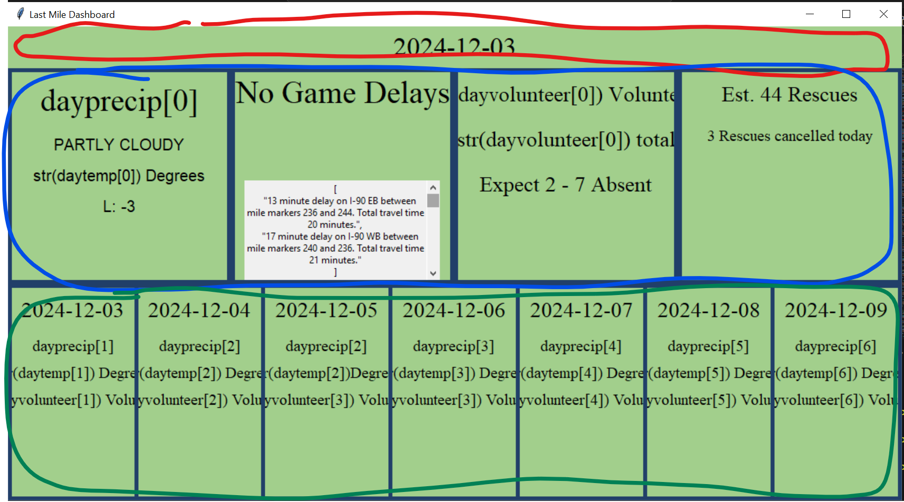

# Developer Documentation 
<p><em>Last Mile 2</em><p> 


### How to set up the environment if it's not executable:
<ol>
    <li> Install PyInstaller:
    Type below command in the command prompt to create python to executable. 
    
    pip install pyinstaller

</li>
    <li> Prepare Your Script: 
    Make sure the Python script is working as expected.
    </li>
    <li> Run the Packing Command:
    Use PyInstaller to generate the .exe file.

    pyinstaller --onefile Last_Mile_2.py
</li>
    <li>Locate the .exe File:
    After running the command, you can find the .exe file in the <em>dict</em> directory.
    </li>
</ol>

## Documentation of API's:
<p><strong>There are several different API's that this program runs on such as:</strong>
    <ul>
        <li>Odds Data API.</li>
        <li>OHGO API.</li>
        <li>National Weather Service API.</li> 
    </ul>
<strong>To get to the API's if you want to view how the code runs access the following files:</strong>
    <ol>
        <li>Traffic_API.py for traffic and incident reports along with travel delays.  
        <li>Sports_API.py for sports game information.
        <li>Weather_API.py for 7 days forecast with a chance of precipitation.
    </ol>
<p><strong>For running the API on your own:</strong>
    <ul> 
        <li>You will need to set up your account at each website</li>
        <li>With each website you will need to get your own API key</li>
        <li>For Traffic and Sports API you will replace the API_KEY with your API key you get from the website</li>
        <li>For Weather API you will need to replace USER_AGENT with your own account email address</li>
    </ul>
</p>
<strong>Features of the API's are all a bit different in the formats that they return and how they operate:</strong>
    <ol>
        <li>Traffic API works by taking the location variable that has been to Cincinnati. Then by swapping the endpoint variable out for different valid endpoints in OHGO's API, it fetches construction data, incidents data, and travel delays. In its main, it takes the data that has been fetched for each endpoint and prints out the respective data for each fetch.</li>
        <li>Sports API works in a similar way as the Traffic API with it swamping the endpoint variable out of valid endpoints: americanfootball_nfl, americanfootball_ncaaf, soccer_usa_mls, and baseball_mlb. For each of these endpoints, it searches from the list called CINCINNATI_TEAMS to look for teachers in their respective areas. If it finds that a team from Cincinnati has a game it returns a team to the home_team variable and the other team to the away_team value. Along with this, it returns the game in date-time format for when it starts. If it does not find a Cincinnati team playing soon it will return that there is no game today. Additionally, the API includes a function for the GUI to reference called conflictCheck. This function reads in a date in date-time format and will check if there are any sporting events on that date. If there is a conflict, the function will return true. This is utilized in the GUI to determine whether a notification of a sporting event needs to be displayed or not.</li>
        <li>Weather API works by giving a 7-day forecast for a location that has been put into coordience to search within that grid. At the current moment, it gives a forecast of the next 7 days with a high to low for the day and night times. It also returns that string that gives us the value from precipitation for that day.
        </li>
    </ol>
</p>

## Documentation of SKLearn Model:
<p>Information on what each section of the SciKitPorgram.py does:
    <ol>
        <li> First Section are simple imports that allow the SKLearn to run along with some imports for the live weather API.
        <li> Live Weather API Info: URL and login information for the API along with location information.
        <li> Variables for GUI: Array variables for weather and volunteer information for the GUI to use.
        <li> Load Data: Reads in two separate CSV files; Historic weather data and historic Last Mile data.  Creates a singular data frame using both files and combines the same-day deliveries into one variable for each day known as volunteers.  The last part selects only the columns used for the SKLearn Model.
        <li> Preprocess Data: Create features and target data variables. Identifies categorical vs numerical data for the Pipeline
        <li> Create Pipeline: Creates a pipeline that transforms the data into numerical data that can be used by the model.
        <li> Train and Evaluate: Trains data using a Logistic Regression model and dumps model into finalized_model.plk
        <li> Predict Volunteers: Creates a function that takes parameters used in the model and outputs a volunteer prediction
        <li> Get Weather Data: Retrieves Live Weather data from the API
        <li> Display Forecast: Transforms weather data into 3 arrays, one for temperature, precipitation, and volunteer estimate. Precipitation data still in not int format
    </ol>
</p>

## Documentation of API's:
<p><strong>There are several different API's that this program runs on such as:</strong>
    <ul>
        <li>Odds Data API.</li>
        <li>OHGO API.</li>
        <li>National Weather Service API.</li> 
    </ul>
<strong>To get to the API's if you want to view how the code runs access the following files:</strong>
    <ol>
        <li>Traffic_API.py for traffic and incident reports along with travel delays.  
        <li>Sports_API.py for sports game information.
        <li>Weather_API.py for 7 days forecast with a chance of precipitation.
    </ol>
<p><strong>For running the API on your own:</strong>
    <ul> 
        <li>You will need to set up your account at each website</li>
        <li>With each website you will need to get your own API key</li>
        <li>For Traffic and Sports API you will replace the API_KEY with your API key you get from the website</li>
        <li>For Weather API you will need to replace USER_AGENT with your own account email address</li>
    </ul>
</p>
<strong>Features of the API's are all a bit different in the formats that they return and how they operate:</strong>
    <ol>
        <li>Traffic API works by taking the location variable that has been to Cincinnati. Then by swapping the endpoint variable out for different valid endpoints in OHGO's API, it fetches construction data, incidents data, and travel delays. In its main, it takes the data that has been fetched for each endpoint and prints out the respective data for each fetch.</li>
        <li>Sports API works in a similar way as the Traffic API with it swamping the endpoint variable out of valid endpoints: americanfootball_nfl, americanfootball_ncaaf, soccer_usa_mls, and baseball_mlb. For each of these endpoints, it searches from the list called CINCINNATI_TEAMS to look for teachers in their respective areas. If it finds that a team from Cincinnati has a game it returns a team to the home_team variable and the other team to the away_team value. Along with this, it returns the game in date-time format for when it starts. If it does not find a Cincinnati team playing soon it will return that there is no game today. Additionally, the API includes a function for the GUI to reference called conflictCheck. This function reads in a date in date-time format and will check if there are any sporting events on that date. If there is a conflict, the function will return true. This is utilized in the GUI to determine whether a notification of a sporting event needs to be displayed or not.</li>
        <li>Weather API works by giving a 7-day forecast for a location that has been put into coordience to search within that grid. At the current moment, it gives a forecast of the next 7 days with a high to low for the day and night times. It also returns that string that gives us the value from precipitation for that day.
        </li>
    </ol>
</p>

## Documentation of SKLearn Model:
<p>Information on what each section of the SciKitPorgram.py does:
    <ol>
        <li> First Section are simple imports that allow the SKLearn to run along with some imports for the live weather API.
        <li> Live Weather API Info: URL and login information for the API along with location information.
        <li> Variables for GUI: Array variables for weather and volunteer information for the GUI to use.
        <li> Load Data: Reads in two separate CSV files; Historic weather data and historic Last Mile data.  Creates a singular data frame using both files and combines the same-day deliveries into one variable for each day known as volunteers.  The last part selects only the columns used for the SKLearn Model.
        <li> Preprocess Data: Create features and target data variables. Identifies categorical vs numerical data for the Pipeline
        <li> Create Pipeline: Creates a pipeline that transforms the data into numerical data that can be used by the model.
        <li> Train and Evaluate: Trains data using a Logistic Regression model and dumps model into finalized_model.plk
        <li> Predict Volunteers: Creates a function that takes parameters used in the model and outputs a volunteer prediction
        <li> Get Weather Data: Retrieves Live Weather data from the API
        <li> Display Forecast: Transforms weather data into 3 arrays, one for temperature, precipitation, and volunteer estimate. Precipitation data still in not int format
    </ol>
</p>


## Documentation of the GUI

<p>The basics of the GUI:
    <ol>
<li> The top of the GUI is composed of sections that import functions and variables from the library as well as other files in the folder

<br>
<li> The main window for the application is created with the code section seen below.

<br>

```
# Create main dashboard = tk.Tk()
dash = tk.Tk()
# window size
dash.geometry("1130x600")
# background color
dash.configure(bg="#a2cf8c")
# title that appears at the top left of the windo
dash.title("Last Mile Dashboard")
```

 <li> The code directly below it replaces the default logo with a png (not included in the folder). This code reuires the full image path for the folder to display properly so it would not work on different devices. 

 <br>
 <li> The GUI is composed of three large main frames which are composed of smaller frames and labels for organizations. The three frames are listed and seen below:
 <br> Day frame (red)
 <br> Top frame (AKA LeftMainFrame in blue)
 <br> bottom frame (green)

<br> 

    today = tk.Frame(
    dash,
    height=20,
    bg="#a2cf8c"
    )

    LeftMainFrame = tk.Frame(
    dash,
    bg="#213f69"
    )

    bottomFrame = tk.Frame(
    dash,
    bg="#213f69"
    )


<li> Keep in mind that the .pack code directly after the frame code actually creates in and tells it how to be positioned as well as other properties.

<br>
<li> The top and bottom frame is composed of various smaller frames which each contain a number of Labels which display the information given by the various APIs
</ol>
</p>

<p> The GUI formatting 
<ol>

<li> Each frame and label created has different formatting and various customizations for each which can be seen in the example below:

<br>

    tempAlert = tk.Label(
    section1,    # This is where the label or frame should be placed
    text="PARTLY CLOUDY",    #Only applies to labels, this is what it will display
    bg="#a2cf8c",    #The background color of the frame or label
    font=(30)    # The font size
    )

<li> In order for the frames and labels to be created, they need the .pack line, this causes them to become blocks in which Tkinter will place. An example is shown below.

<br>

    section1.pack(
    padx=5,    # The amount of padding or space on the left and right
    pady=5,    # the amount of space above and below the text
    side="left",   #The side in which the block will be placed
    fill="both",    #should the block expand on the X, Y or both axis?
    expand=True    #Should the block expand to fill the available space in the frame?
    )

<li> These frames serve to format the information that is inputted into the GUI from the APIs. The program refromats the information given by the API to display properly on the GUI. 

<br> 
<li> There is also a function in the code in which gives the date of the current day and can be incremented to show future days.

<br>

    todayDate += timedelta(days=1)

<br>
<li>  There is unused code at the very end of the GUI program we had originally planned to use to convert the program to an application for use but we did not get to it. There may be an easier way to convert the program into an application.

</ol>
</p>
