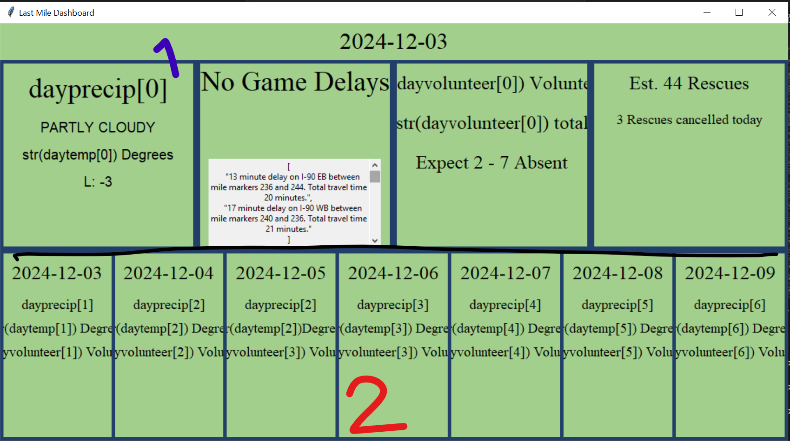

# <strong>User Documentation<strong>

<em>Last Mile 2</em>

How to run the program: 
<ol>
<li>First start by opening the folder that contains the program called Last_Mile</li>
<li> Install PyInstaller:
    Type below command in the command prompt to create python to executable. 
    
    pip install pyinstaller

</li>
    <li> Prepare Your Script: 
    Make sure the Python script is working as expected.
    </li>
    <li> Run the Packing Command:
    Use PyInstaller to generate the .exe file.

    pyinstaller --onefile Last_Mile_2.py
</li>
    <li>Locate the .exe File:
    After running the command, you can find the .exe file in the <em>dict</em> directory.
    </li>
</ol>

 

  

<h2>
How to Navigate the Guided User Interface (GUI)
</h2>

<ol>
<li> Once the GUI has loaded you will notice the color theme of the Last Mile logo. The GUI is seperated into two main parts, the top half and the bottom. Keep in mind that the GUI does not refresh automatically or have a refresh button, so the application must be closed and ran again to refresh it.
</li>
 

 

<li> The top half is composed of a long horizontal bar and four sections. The bar displays the current date.
</li>

 
<ol> A. The first box (starting from the left) is The weather information section. This section displays weather info such as temperature, precipitation, and condition 
 
B. The next section displays sports and traffic delays. The sports games will either display "No Game Delays" if no Cincinnati sports home games are found or "Sport Delays" if one is found.
The box with the scroll bar is the traffic delays. It will display all delays and locations in the Cincinnati area. The scroll bar will not work if all delays are able to be shown on the screen.
 
C. The next section is the volunteer prediction screen in which the application will give an estimate of how many volunteers are expected, how many total and how many to expect to be absent based on previous data and weather data. 
 
D. The last section gives the extimate of the rescue data. The application will give an estimate of the total rescues and the rescues that would be cancelled for that given day. 

</ol>

<li>The Bottom half of the screen displays the upcoming seven days and the summary for each day. The summaries include:</li>
A. The Date at the Top
 
B. The precipitation or the weather conditions
 
C. The temperature for the day
 
D. The expected volunteers for that day

 
<li> The GUI does not refresh on its own, to get new information, the application must be closed and ran again. Currently there is a limit on how many times the traffic info can be pulled at a time. It will stop running after that limit has been reached.

